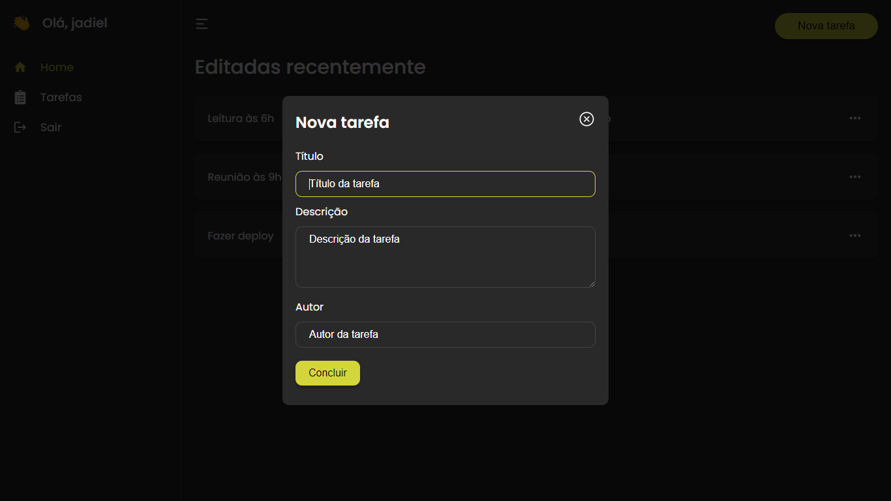

# Todo List Frontend


This project are consuming a Laravel API. The user must be logged to **create**, **read**, **update** and **delete** tasks.



# Content Table

* <a href="#features">Features</a>
* <a href="#get-started">Get Started</a>

# Features

- [x] Next Route
- [x] All Fields Validated
- [x] Authentication
- [x] Responsive Design
- [x] Read All Tasks
- [x] Read Only One Task
- [x] Create Task
- [x] Update Task
- [x] Delete Task

# Get Started

### 1 - Clone this project

```bash
git clone https://github.com/jadielsanttos/todo_list_frontend.git
```

### 2 - Navigate to the project dir

```bash
cd todo_list_frontend
```

### 3 - Install packages

```bash
npm install
```

### 4 - Run project

```bash
npm run dev
# or
yarn dev
# or 
pnpm dev
```

### 5 - Open your browser

Access [http://localhost:3000](http://localhost:3000) and done!


